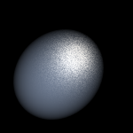
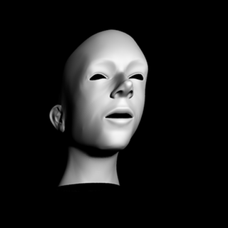

# PyTracer

*Proudly rendered with `pytracer`, head model courtesy of CS238b.*

## Introduction

PyTracer is a photo-realistic rendering interface
backended by ray tracing. It may sound
counter-intuitive that one may ever wish to
implement a ray tracer with `Python`, nevertheles,
PyTracer makes it feasible to do fast prototyping
using current state-of-the-art learning libraries
which are mostly implemented in `Python`.

Indeed, albeit to being *a little bit* slow, PyTracer can do it pretty well.
Its object-oriented nature and modular design enables easy experiementing
of new algorithms.
The development and implementation of PyTracer largely take references from
*[Physically Based Rendering](http://pbrt.org/)*,
both second and third edition.

## Usage

The `Cython` integration has not been built, hence no setup
is needed.
The main work flow of PyTracer is analogous to `pbrt`, and
a quick tutorial with examples is provided in the [Quick Start Guide](Quick%20Start.ipynb).

## Features

Currently, PyTracer supports the following
features:

- Triangle Mesh with Loop Subdividing Surface Modeling;
- Full Spectrum Rendering (Sampling Spectrums Supported);
- Bounding Volume Hierarchy Accelerator;
- Projective, Perspective and Orthographic Cameras;
- Multiple Types of Textures;
- Multiple Types of Materials including Irregular Sampled Isotropic BRDF;
- Spot and Area Diffuse Lights;
- Monte Carlo Integration with MCMC Samplers;
- (Single) Path Integrator and Direct Lighting Integrator.

Users familiar with `pbrt` may find it intuitive to work with other components.

## Development

PyTracer is still under development for supporting more features,
which are, tentatively:

- MERL BRDF Support;
- Volume Scattering Modeling;
- Bidirectional Path Tracing and More Light Transport Algorithm;
- Direct support to `pbrt` Flavour Input Files and Other UI/UX Improvements;
- Optimization with `Cython`;

## Known Issues

- **Speed**. PyTracer is currently amazingly slow.
- **Robustness**. Some components are implemented but have not been
thoroughly tested yet. Please use with caution.

## Gallery

## Cite This Project

PyTracer is maintained by [Jiayao Zhang](https://i.cs.hku.hk/~jyzhang) and
[Li-Yi Wei](https://www.liyiwei.org/). The `bib` entry for this repo may be
as follows:

    @misc{pytracer:2017,
		title = {pyTracer},
		year = {2017},
		author = {Jiayao, Zhang and Li-Yi, Wei},
		publisher = {GitHub},
		journal = {GitHub Repository},
		howpublished= {\url{https://github.com/zjiayao/pyTracer}
    }
